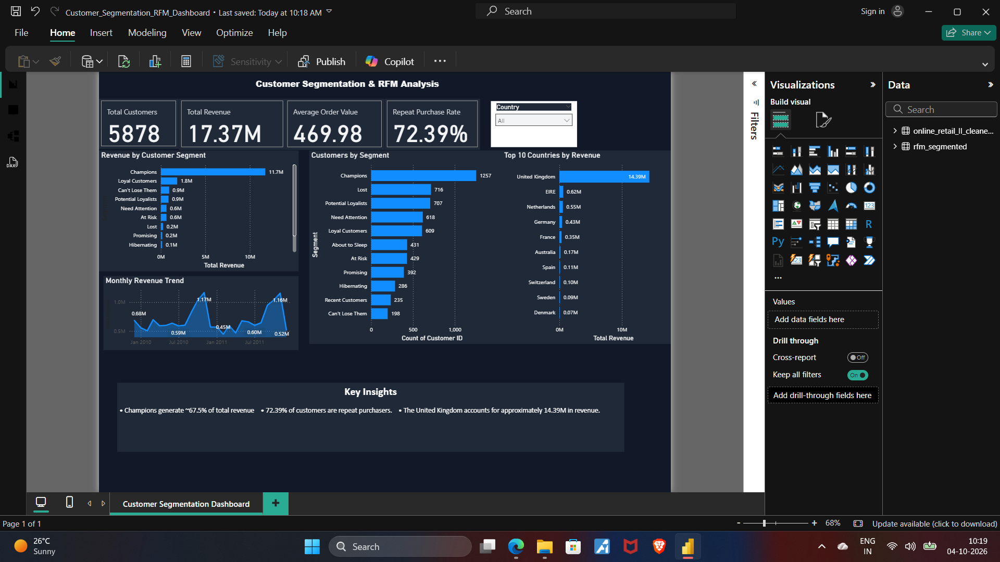

# Customer Segmentation & RFM Analysis --- Online Retail II

A customer segmentation and analytics project using the **Online Retail
II** dataset. The project combines data cleaning, exploratory analysis,
RFM scoring, customer segmentation, MySQL-based business analysis, and a
Power BI dashboard.

## Project Objective

The goal is to understand customer value and purchasing behavior by
answering questions such as:

-   Which customer segments generate the most revenue?
-   How many customers are repeat purchasers?
-   Which countries contribute the most revenue?
-   How does revenue change over time?
-   Which products lead by quantity and by revenue?
-   How does average order value differ across customer segments?

## Project Workflow

**Raw Transaction Data → Data Cleaning → EDA → RFM Analysis → Customer
Segmentation → SQL Business Analysis → Power BI Dashboard**

## Phase 1 --- Data Cleaning & EDA

-   Cleaned transaction dataset: **779,425 rows**
-   Key fields include Invoice, StockCode, Description, Quantity,
    InvoiceDate, Price, Customer ID, and Country.
-   Performed exploratory analysis and produced supporting outputs for
    the main EDA questions.

## Phase 2 --- RFM Scoring & Customer Segmentation

RFM analysis evaluates customers using:

-   **Recency** --- how recently a customer purchased
-   **Frequency** --- how often a customer purchased
-   **Monetary** --- how much a customer spent

Customers were scored and classified into **11 segments**, including
Champions, Loyal Customers, Potential Loyalists, At Risk, Lost, Recent
Customers, About to Sleep, Promising, Hibernating, Need Attention, and
Can't Lose Them.

Final RFM output:

-   **5,878 customers**
-   8 fields: Customer ID, Recency, Frequency, Monetary, R_Score,
    F_Score, M_Score, Segment

## Phase 3 --- MySQL Database & Analytical SQL

The cleaned transaction data and customer-level RFM data were loaded
into a local **MySQL 8.0** database.

### Tables

-   `rfm_customers` --- customer-level RFM data
-   `retail_transactions` --- transaction-level retail data

### Data validation

-   **5,878** customer records
-   **779,425** transaction records
-   Zero orphaned transactions
-   Zero unparsed dates

Eight analytical SQL queries were developed and validated using JOINs,
subqueries, aggregations, CASE logic, date functions, and window
functions.

## Data Engineering Debugging

During the initial MySQL load, `LOAD DATA LOCAL INFILE` completed
without errors but inserted zero rows.

The issue was diagnosed systematically:

1.  Verified the file paths.
2.  Ran the load interactively to isolate the problem.
3.  Inspected the CSV line endings.
4.  Found Unix-style `\n` line endings rather than the assumed Windows
    `\r\n`.
5.  Updated the SQL load configuration and reloaded the data.
6.  Verified the expected row counts after the fix.

## Key Business Findings

  -----------------------------------------------------------------------
  Analysis                            Finding
  ----------------------------------- -----------------------------------
  Revenue by segment                  **Champions:** 1,257 customers
                                      (\~21% of the customer base) and
                                      approximately **11.7M** in revenue

  Revenue concentration               Champions contribute approximately
                                      **67.5% of total revenue**

  Repeat purchasing                   **72.39%** of customers placed more
                                      than one order

  Country contribution                **United Kingdom:** 5,350 customers
                                      and approximately **14.39M** in
                                      revenue

  Highest AOV segment                 **Champions:** 535.80 average order
                                      value

  Lowest AOV segment                  **About to Sleep:** 211.77 average
                                      order value

  Top product by quantity             **WORLD WAR 2 GLIDERS ASSTD
                                      DESIGNS:** 105,185 units

  Top product by revenue              **REGENCY CAKESTAND 3 TIER:**
                                      approximately 277,656

  Revenue trend                       Recurring revenue spikes around
                                      **September--November** across the
                                      available years
  -----------------------------------------------------------------------

> Product rankings also surfaced non-product stock codes such as `M`
> (Manual) and `POST` (Postage), highlighting a data-quality
> consideration for a production pipeline.

## Phase 4 --- Power BI Dashboard

A one-page Power BI dashboard was created to communicate the main
findings.

### Dashboard includes

-   Total Customers
-   Total Revenue
-   Average Order Value
-   Repeat Purchase Rate
-   Revenue by Customer Segment
-   Customers by Segment
-   Monthly Revenue Trend
-   Top 10 Countries by Revenue
-   Country slicer
-   Key business insights

### Dashboard Preview



## Project Structure

``` text
customer-segmentation-rfm-analysis/
├── README.md
├── data/
│   ├── rfm_segmented.csv
│   └── README.md
├── python/
│   ├── q1_recency_frequency_by_segment.py
│   ├── q2_country_customers_revenue.py
│   ├── q3_monthly_sales_trend.py
│   └── q4_customer_value_outliers.py
├── sql/
│   ├── phase3_rfm_schema_and_load.sql
│   └── phase3_analytical_queries.sql
├── analysis/
│   ├── business_questions_answers.md
│   └── phase3_sql_setup.md
├── outputs/
│   ├── q1_recency_frequency_by_segment.png
│   ├── q2_top_10_countries_by_revenue.png
│   ├── q3_monthly_revenue_trend.png
│   └── q4_customer_revenue_concentration.png
├── powerbi/
│   └── Customer_Segmentation_RFM_Dashboard.pbix
└── images/
    └── dashboard.png
```

## Tech Stack

-   **Python**
-   **pandas**
-   **MySQL 8.0**
-   **Power BI**
-   SQL
-   Data Cleaning
-   Exploratory Data Analysis
-   RFM Analysis
-   Customer Segmentation
-   Business Analytics

## Skills Demonstrated

-   Data cleaning and preparation
-   Exploratory data analysis
-   Customer-level feature engineering
-   RFM analysis and segmentation
-   SQL database loading and validation
-   Analytical SQL
-   Business question formulation
-   Data visualization
-   Power BI dashboard development
-   Communicating analytical findings

## Project Status

**Completed**

The project covers the workflow from transaction-level data preparation
through customer segmentation, SQL analysis, and final Power BI
visualization.
